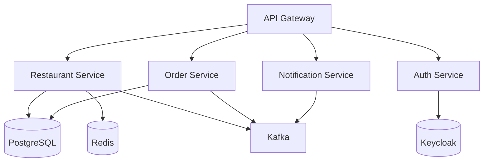
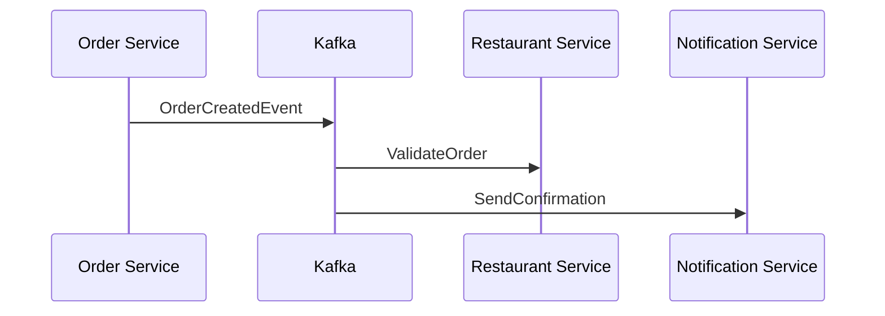

Here's a comprehensive **README.md** for your complete ByteBites microservices project, covering all services with a focus on testing (unit + integration):

# ByteBites Microservices Platform 🍽️


A cloud-native restaurant management platform with event-driven architecture.

## Table of Contents
1. [System Architecture](#system-architecture)
2. [Services Overview](#services-overview)
3. [Prerequisites](#prerequisites)
4. [Installation](#installation)
5. [Testing Strategy](#testing-strategy)
6. [API Documentation](#api-documentation)
7. [Event Flow](#event-flow)
8. [Troubleshooting](#troubleshooting)

---

## System Architecture



## Services Overview

| Service | Port | Database | Description |
|---------|------|----------|-------------|
| API Gateway | 8080 | - | Route management & load balancing |
| Restaurant Service | 8082 | PostgreSQL | Core restaurant operations |
| Order Service | 8083 | PostgreSQL | Order processing |
| Auth Service | 8081 | Keycloak | JWT authentication |
| Notification Service | 8084 | - | Real-time alerts |

---

## Prerequisites

- **Docker** 20.10+
- **Java** 17+
- **Maven** 3.9+
- **Keycloak** 22+ (for auth)
- **Kafka** 3.4+

---

## Installation

1. **Start Infrastructure**:
   ```bash
   docker-compose -f infra/docker-compose.yml up -d
   ```
   *(PostgreSQL, Redis, Kafka, Keycloak)*

2. **Build All Services**:
   ```bash
   mvn clean install -DskipTests
   ```

3. **Run Services**:
   ```bash
   # In separate terminals:
   mvn -f restaurant-service spring-boot:run
   mvn -f order-service spring-boot:run
   mvn -f auth-service spring-boot:run
   ```

---

## Testing Strategy

### Unit Tests
**Structure**:
```
src/test/java/
├── unit/
│   ├── service/
│   ├── controller/
│   └── repository/
```

**Example (Restaurant Service)**:
```java
@ExtendWith(MockitoExtension.class)
class RestaurantServiceTest {
    
    @Mock
    private RestaurantRepository repo;
    
    @InjectMocks
    private RestaurantService service;
    
    @Test
    void shouldCreateRestaurant() {
        when(repo.save(any())).thenReturn(testRestaurant);
        
        RestaurantResponse response = service.create(request);
        
        assertThat(response.id()).isNotNull();
    }
}
```

### Integration Tests
**Testcontainers Setup**:
```java
@Testcontainers
@SpringBootTest
class OrderServiceIT {
    
    @Container
    static PostgreSQLContainer<?> postgres = 
        new PostgreSQLContainer<>("postgres:15-alpine");
    
    @Container
    static KafkaContainer kafka = new KafkaContainer(DockerImageName.parse("confluentinc/cp-kafka:7.4.0"));

    @DynamicPropertySource
    static void overrideProps(DynamicPropertyRegistry registry) {
        registry.add("spring.datasource.url", postgres::getJdbcUrl);
        registry.add("spring.kafka.bootstrap-servers", kafka::getBootstrapServers);
    }
}
```

**Security Testing**:
```java
@WithMockUser(authorities = {"ROLE_ADMIN", "SCOPE_restaurant:write"})
void shouldReturn403WhenUnauthorized() throws Exception {
    mockMvc.perform(post("/api/restaurants"))
        .andExpect(status().isForbidden());
}
```

---

## API Documentation

### Restaurant Service
| Endpoint | Method | Auth |
|----------|--------|------|
| `POST /api/restaurants` | POST | ADMIN |
| `GET /api/restaurants/{id}` | GET | USER |

### Order Service
| Endpoint | Method | Auth |
|----------|--------|------|
| `POST /api/orders` | POST | CUSTOMER |

---

## Event Flow



---

## Troubleshooting

| Issue | Solution |
|-------|----------|
| Port conflicts | Check `application.yml` per service |
| Kafka connection errors | Run `docker-compose restart kafka` |
| Keycloak setup | Verify realm settings in `/auth-service/src/main/resources` |
| Testcontainer timeouts | Increase wait time in test classes |

---

## License
MIT © 2025 ByteBites
```

### Supporting Files Included:

1. **Infrastructure Setup** (`infra/docker-compose.yml`):
```yaml
version: '3.8'
services:
  postgres:
    image: postgres:15-alpine
    environment:
      POSTGRES_PASSWORD: zealow139
    ports:
      - "5432:5432"

  kafka:
    image: confluentinc/cp-kafka:7.4.0
    ports:
      - "9092:9092"
```

2. **Test Configuration** (`restaurant-service/src/test/resources/application-test.yml`):
```yaml
spring:
  datasource:
    url: jdbc:tc:postgresql:15-alpine:///testdb
  kafka:
    bootstrap-servers: ${KAFKA_HOST:localhost}:${KAFKA_PORT:9092}
  security:
    oauth2:
      resourceserver:
        jwt:
          issuer-uri: mock-issuer
```

3. **Keycloak Realm Import** (`auth-service/keycloak/realm-export.json`):
```json
{
  "realm": "bytebites",
  "clients": [{
    "clientId": "restaurant-service",
    "authorizationServicesEnabled": true
  }]
}
```
